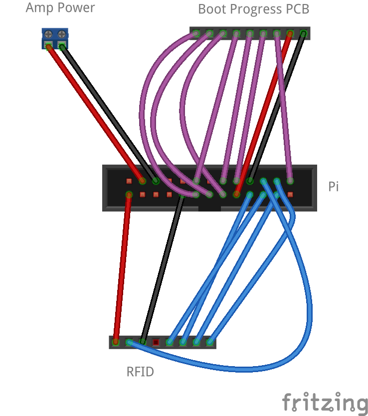

# Physical Details of the Brain

This folder holds things relating to the physical instantiation of the Brain (rather than the software installed on it).

That includes things like the design files for laser-cut enclosures, and design files for [any custom PCB](BootProgressBoard/).

## Wiring

These wiring details use [this Raspberry Pi GPIO connector diagram](http://elinux.org/RPi_Low-level_peripherals#Model_A.2B.2C_B.2B_and_B2) for labels.

### RFID Reader

|Connector P1 (l-r)|Raspberry Pi|
|------------------|------------|
|VCC|+3V3|
|IN|Not connected|
|SDA|GPIO2/SDA1|
|SCL|GPIO3/SCL1|
|OUT|GPIO4|
|GND|GND|

### BootProgressBoard

|Connector P1 (l-r)|Raspberry Pi|
|------------------|------------|
|1|GPIO24|
|2|GPIO25|
|3|GPIO17|
|4|GPIO27|
|5|GPIO22|
|6|GPIO23|
|7|GPIO10|
|8|+3V3|
|9|GND|

### Raspberry Pi 2/3

Audio is provided by an amplifier board connected to the 3.5mm jack on the Pi.

See [here for a diagram showing the 3.5mm connections](http://www.raspberrypi-spy.co.uk/2014/07/raspberry-pi-model-b-3-5mm-audiovideo-jack/)

|Amp|3.5mm jack on the Pi|
|---|--------------------|
|Left|Tip|
|Right|Ring 1|
|Ground|Ring 2|
|Not connected|Sleeve|

### Raspberry Pi Zero

Audio is provided by a DAC board.  Either the [Pimoroni pHat DAC](https://shop.pimoroni.com/products/phat-dac) with stackable headers; or the [Adafruit I2S DAC/Amp board](https://learn.adafruit.com/adafruit-max98357-i2s-class-d-mono-amp/overview).

For the DAC/Amp the connections are as follows:

|DAC/Amp board|Raspberry Pi|
|-------------|------------|
|LRC|GPIO19/MISO|
|BCLK|GPIO18|
|DIN|SCLK/GPIO21|
|GAIN|Not connected|
|SD|Not connected|
|GND|GND|
|Vin|+5V|

Because the DACs don't have volume controls, we add two buttons for volume up and down.  They're connected as follows (l-r in [this photo](https://www.flickr.com/photos/amcewen/31221595945/)):

|Volume board|Raspberry Pi|
|------------|------------|
|Volume up|GPIO6|
|Volume down|GPIO13|
|Ground|GND|
|Pin with neither button but both resistors|Not connected|

## Assembly

This isn't necessarily the *only* way to assemble the Brain, but the general order that we've taken.

### Assemble "base of the skull"

1. Test assemble the speaker frame and then glue it together with the speaker inside
1. Bolt Raspberry Pi into the base
1. Bolt feet onto the base

### Assemble "top of the skull"

1. Lay out all the components to check that you've got everything.
1. Insert the 4 t-nuts into the base of the top
1. Solder the right-angle header onto the RFID reader
1. Test assemble the RFID reader frame, and then glue together
1. Check the fit for the pieces making up the main box
1. Glue together the pieces for the main box, apart from the base with the t-nuts
1. Once the main box is dry, glue in the base with the t-nuts
1. Sand down the box (if it's not acrylic)
1. Apply one or two coats of Danish oil to the box (similarly if it's not acrylic)

### Wiring the Boot Progress PCB

1. Solder up the Boot Progress Board PCB

### Wiring the audio circuit

1. For the analogue amplifier Brains, solder header pins into the amplifier
1. We use pre-assembled [cables connected to a TRRS 4-pole 3.5mm jack plug](http://uk.farnell.com/cliff-electronic-components/fc68122c/cable-assembly-jack-plug-4-way/dp/2470995?CMP=i-bf9f-00001000) to connect to the Pi, so check that which wire colour goes to which pole on the plug.  If you're soldering your own wires to a 3.5mm plug, then obviously you'll know which is which.  In our case the colour-coding is:
  * Tip: red
  * Ring 1: white
  * Ring 2: black
  * Sleeve: shielding
  Or for the double-ended cables we're using in v1, the colour-coding is:
  * Tip: red
  * Ring 1: white
  * Ring 2: green
  * Sleeve: blue
1. Assuming you're using the same [3.5mm switched audio jack](http://www.digikey.co.uk/product-detail/en/cui-inc/SJ1-3535/CP1-3535-ND/738693) as we do, then connect the following connections to wire the 4-pole TRRS plug to the aux audio jack:
  * Tip (red) to connection 2
  * Ring 1 (white) to connection 3
  * Ring 2 (black/green) to connection 1
  * Sleeve is left unconnected
1. If you're using the same amplifier board as us, you should desolder the audio jack from it.  When you have, the connections&mdash;when viewed from underneath, from left to right&mdash;are tip \ sleeve / ring (on a TRS stereo jack)
1. Wire the output connections of the aux jack to the amplifier, with ~12cm of cable.  We'll leave the ground connection unconnected as it will prevent a ground loop with the ground connection for power.
  * Connection 4 (red) to the left audio input
  * Connection 5 (white) to the right audio input

### Prep the amp-to-speaker wiring loom

1. Cut a 15cm length of 2-core cable
1. Bare ~5mm of wire at one end and tin the end
1. Bare ~10mm of wire at the other end
1. Insert the longer bared ends through the loops on the terminals on the speaker (if you've got coloured wire, red to positive and black to negative) then fold it back on itself to make a decent physical connection.  Then solder the wires to the speaker terminal

### Assemble main wiring loom

1. Get the RFID to Pi connector cable
1. Wire a two-pin shroud to the 5V and ground connection on the RFID reader shroud to break out power from the Raspberry Pi to the amplifier
1. Assemble the Boot Progress PCB wiring loom with 9-pin shroud and [connections as detailed above](#BootProgressBoard)

### Assembly
1. Fasten the USB extension cable into the main box
1. Mount the speakers into their frame
1. Mount the RFID reader into the frame
1. Mount the Raspberry Pi to the base
1. Glue the frame onto the base
1. Check the fit of the amp and 3.5mm jack socket in the main box
1. Connect up all the electronics and make sure it's all working before it gets installed fully
1. Fit the amp and 3.5mm jack socket into the main box
1. Hot-glue the boot progress board into the main box

